# Benchmarks
The benchmarks compare detria with the following libraries:
- [Triangle](https://www.cs.cmu.edu/~quake/triangle.html)
- [poly2tri](https://github.com/jhasse/poly2tri)
- [CDT](https://github.com/artem-ogre/CDT)

The code to run the benchmarks can be found [here](src/benchmark).

The benchmark only measures the triangulation time, not including the time to set up the inputs (since every triangulator expects input to be in a different format), and not including the time to retrieve the result triangles.  
For CDT, there is no single triangulation method, the calculations start immediately when the points are added, so it is measured accordingly.  
poly2tri doesn't support inputs with multiple outlines, so its runtime could not be measured for those cases.

The benchmarks were compiled with Clang 17.0.3 (with MSVC-like command-line), release build with default compiler flags, on Windows.  
The benchmarks were run on an AMD Ryzen 9 3900X CPU,  Windows 10.

The benchmark data includes:
- Outline of the earth and the "most complex" countries (including countries with a single outline), data is from [Natural Earth](https://www.naturalearthdata.com/)
- Test files from poly2tri
- Fractal test: see [here](images/fractal.png), contains a lot of cocircular points
- Random test: generating uniform random points inside a square - the square has 4 corners and 4 outline edges, the rest of the points are steiner points

The result images include the times required to perform the triangulations, in a box plot format. Red dots are outliers.  
Hover the rows in the images for additional info.

## Results

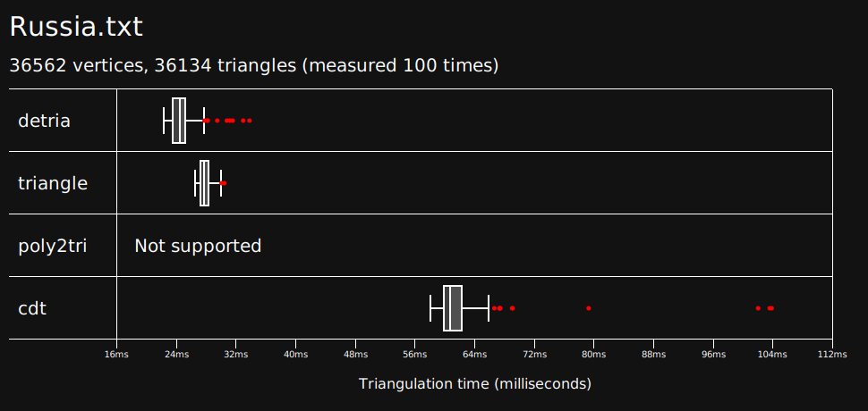

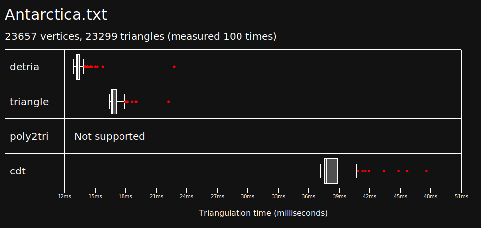

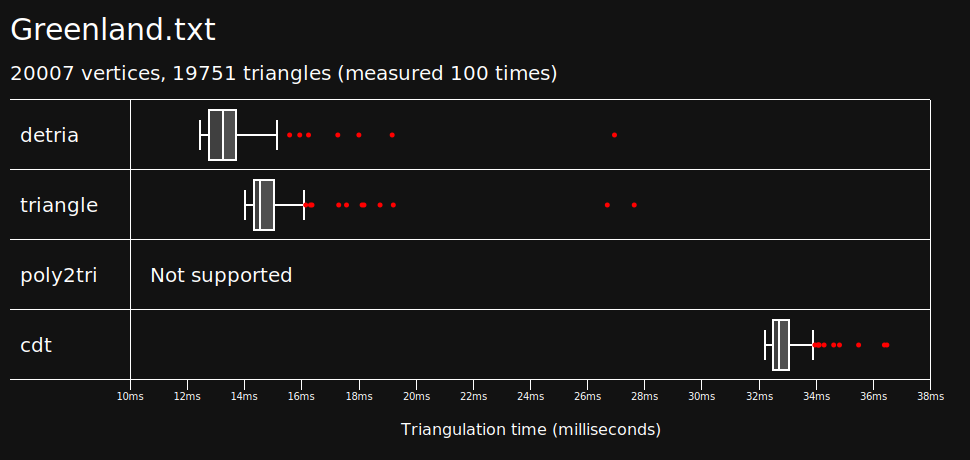

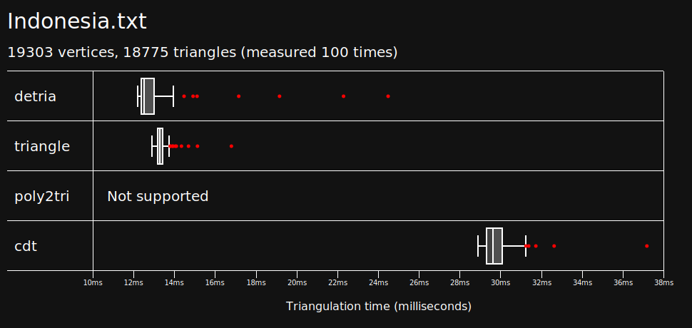

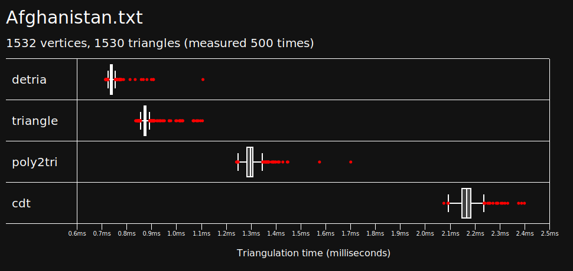

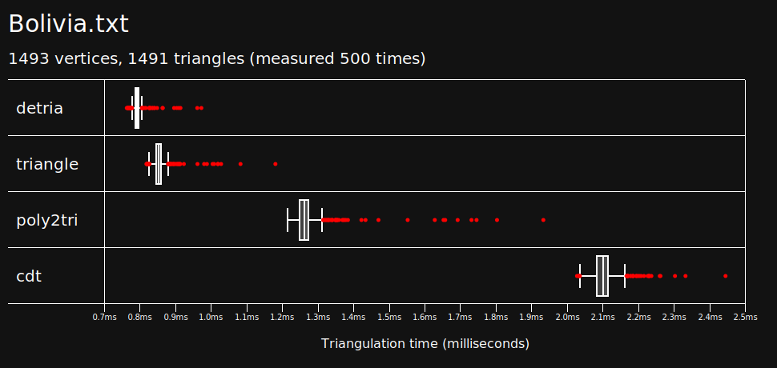

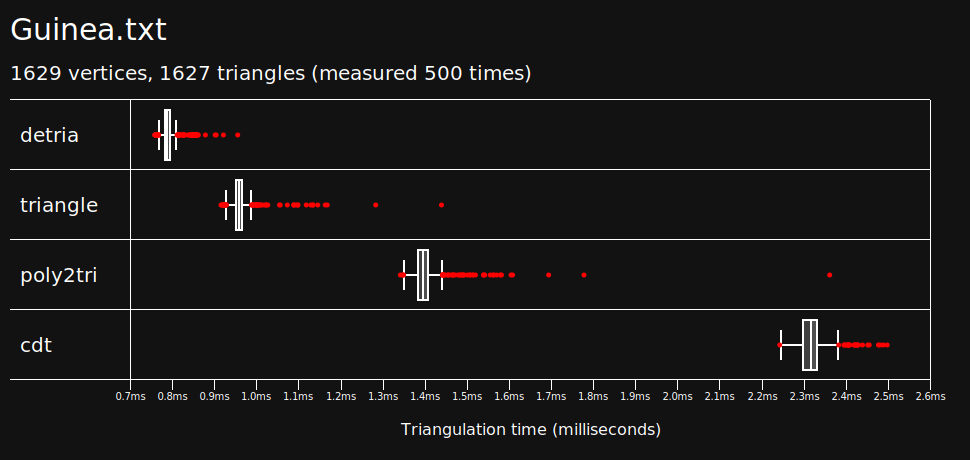

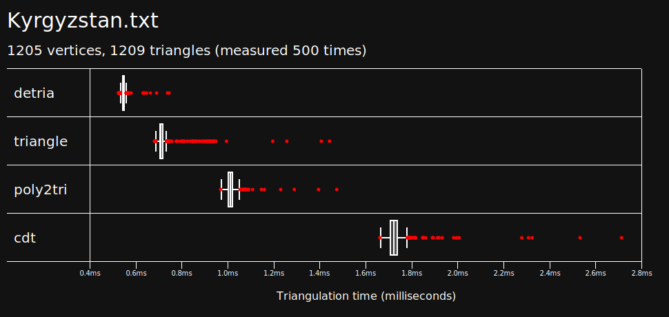

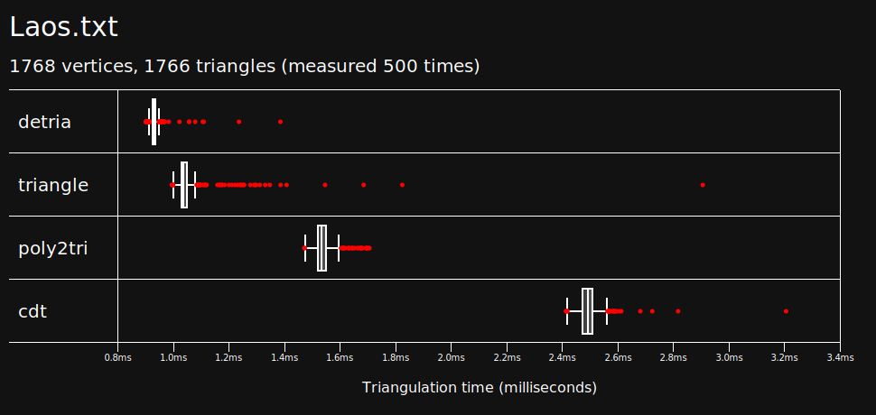

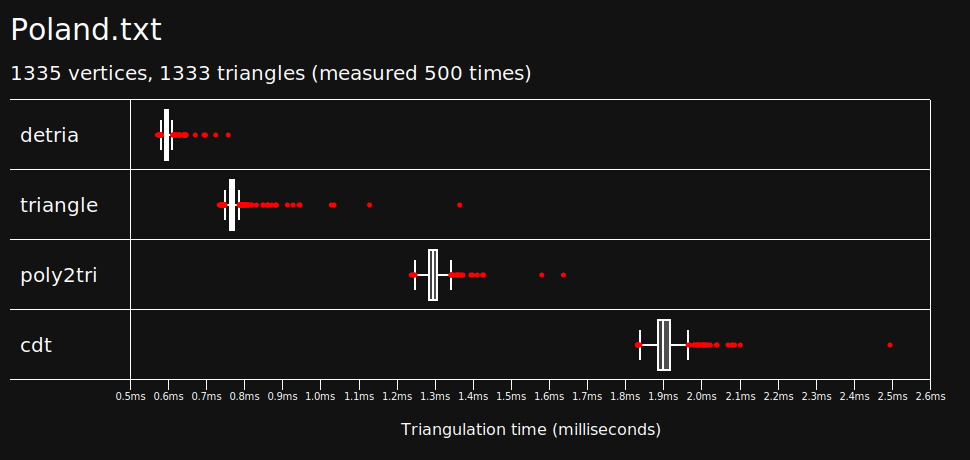

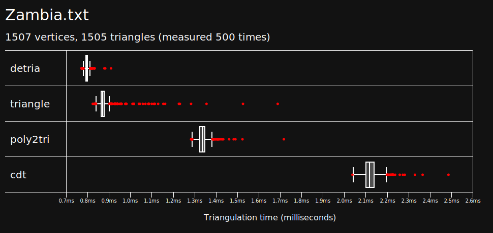

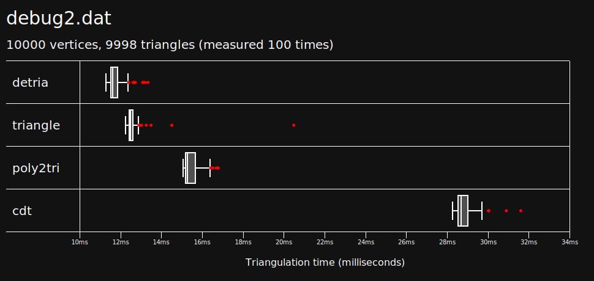

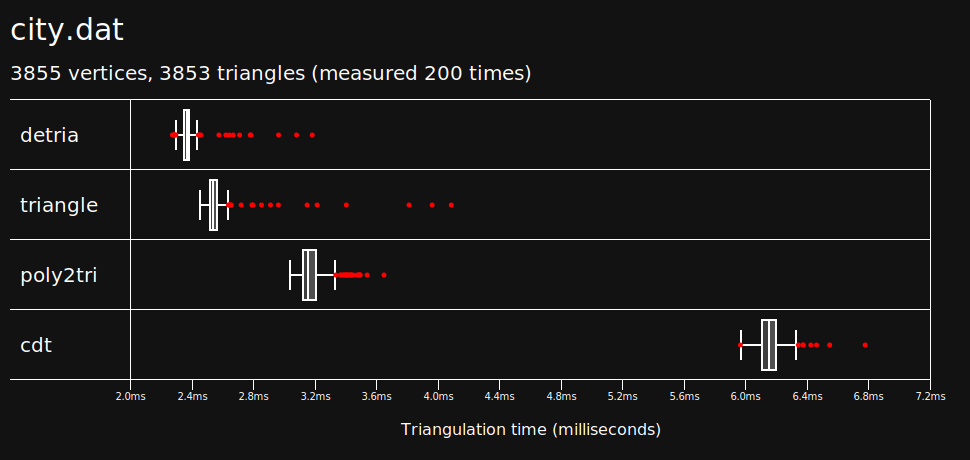

