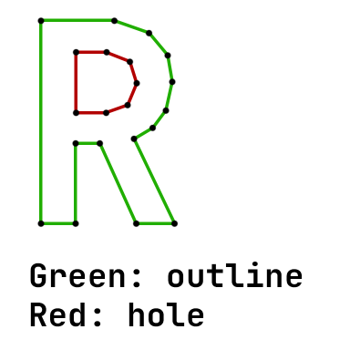
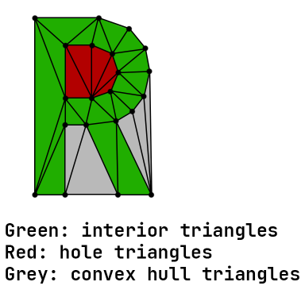

# Basic usage
To triangulate a polygon, you'll need to create a `detria::Triangulation` instance, and provide the list of points and the list of polylines:
```cpp
// create a square, and triangulate it

// list of points (positions)
std::vector<detria::PointD> points =
{
    { 0.0, 0.0 },
    { 1.0, 0.0 },
    { 1.0, 1.0 },
    { 0.0, 1.0 }
};

// list of point indices
std::vector<size_t> outline = { 0, 1, 2, 3 };

bool delaunay = true;

detria::Triangulation tri;
tri.setPoints(points);
tri.addOutline(outline);

bool success = tri.triangulate(delaunay);

if (success)
{
    // iterate over the result triangles

    // should the result triangles be in CW order?
    bool cwTriangles = true;

    tri.forEachTriangle([&](detria::Triangle<size_t> triangle)
    {
        // `triangle` contains the point indices

        detria::PointD firstPointOfTriangle = points[triangle.x];
        detria::PointD secondPointOfTriangle = points[triangle.y];
        detria::PointD thirdPointOfTriangle = points[triangle.z];
    }, cwTriangles);
}
```

# Terminology
- Polyline: List of edges that form a simple polygon. Outlines and holes are polylines.
- Outline: A polyline that contains a "solid" part of the triangulation (will contain interior triangles). 
- Hole: A polyline that will be subtracted from the triangulation (will contain hole triangles).
- Convex hull triangles: When creating the triangulation, the convex hull of the points is automatically calculated. This can cause triangles to be created that are outside every outline, but these triangles are usually not used.

See images below for a visual representation:




# Outlines, holes, and Steiner points
You can add multiple outlines, holes, and Steiner points to the triangulation.  
The orientation of the outlines and holes can be either clockwise or counter-clockwise, it doesn't matter.  
Outlines and holes can be nested, but:
- Every hole must be directly inside an outline
- Every outline must either be inside nothing (top-level), or directly inside a hole

Outlines that are directly inside other outlines, or holes that are directly insode other holes are invalid.  
To add a hole to the triangulation, you can use the `addHole` function.  
If you don't know if a polyline is an outline or a hole, you can use the `addPolylineAutoDetectType` function, which will automatically decide it.  
You can also add a constrained edge between any two vertices using the `setConstrainedEdge`. This ensures that the final triangulation will have an edge between those two vertices.  
Points that are not part of any outlines or holes will be used as Steiner points.  

# Memory safety
The points and polylines are not copied when set, only a pointer is stored. You must make sure that the pointers are still valid during the `triangulate` call. For example:
```cpp
// THIS IS BAD, DON'T DO THIS

detria::Triangulation tri;
if (something)
{
    std::vector<detria::PointD> points = getPoints(...);
    tri.setPoints(points);
}
else
{
    std::vector<detria::PointD> points = getSomeOtherPoints(...);
    tri.setPoints(points);
}

// will crash, the pointer stored in the triangulation is invalid
tri.triangulate(true);
```

```cpp
// THIS IS ALSO BAD, DON'T DO THIS EITHER

detria::Triangulation tri;
std::vector<detria::PointD> points = getPoints(...);
tri.setPoints(points);

points.push_back(getSomeOtherPoint()); // the vector might reallocate here

// undefined behavior, the pointer inside `points` might have been reallocated, and might point to freed memory
tri.triangulate(true);
```

# Using the result of the triangulation
Use the function `forEachTriangle` to iterate over every interior triangle in the result triangulation.  
Use `forEachHoleTriangle` to iterate over hole triangles.  
You can also use `forEachTriangleOfEveryLocation` to iterate over every single triangle, even the convex hull triangles.  
These functions have the following parameters:
- The first parameter is a callback, which will be called for each triangle that has the "correct" location - interior triangles for `forEachTriangle`, and hole triangles for `forEachHoleTriangle`  
The callback must have a single `detria::Triangle<Idx>` parameter (can also have a const reference).
- The second parameter is a boolean value, which determines if the result triangles should be in clockwise orientation (true: clockwise, false: counter-clockwise).  
The default value for this parameter is true (clockwise triangles).

See the "Basic usage" part for a code example.

The function `forEachTriangleOfLocation` is similar to the previous ones, but this one also takes a `detria::TriangleLocation` value, which decides which triangles the callback should be called on.  
The callback passed to this function also must have a `detria::TriangleLocation` parameter as the second parameter.  
Code example:
```cpp
tri.forEachTriangleOfLocation(
    [](const detria::Triangle<Idx>& triangle, detria::TriangleLocation location)
    {
        // do something with `triangle` and `location`
    },

    // you can specify multiple locations
    detria::TriangleLocation::Interior | detria::TriangleLocation::Hole,

    // should the triangles be in clockwise order?
    true
);
```

# Delaunay triangulation of a point set
It's possible to create the delaunay triangulation without any polylines/constrained edges:
```cpp
detria::Triangulation tri;
// only set points, don't add any polylines
tri.setPoints(...);
if (tri.triangulate(true))
{
    // iterate over the triangles
    tri.forEachTriangleOfEveryLocation([](const detria::Triangle<size_t>& triangle)
    {
        // ...
    });
}
```

# Template parameters
The `detria::Triangulation` class has multiple template parameters:
```cpp
template <
    typename Point = PointD,
    typename Idx = uint32_t,
    typename PointAdapter = DefaultPointAdapter<Point>,
    template <typename T, typename Allocator> typename Collection = std::vector,
    typename Allocator = memory::DefaultAllocator
>
class Triangulation
{
    // ...
};
```
- `Point` - The point type used in the triangulation, more details about this in the next section.
- `Idx` - The index type, which will be used when referring to vertex indices. You can use types like `size_t` instead of `uint32_t` if you have the indices in that format.  
Note that the number of points should be less than the max value of the type divided by 8, so e.g. 2^29 for 32-bit numbers, or 8192 for 19-bit. This is because internally, the same index type is used to store vertex-triangle relations, which can be 4\*triangle count, and triangle count is arount 2\*vertex count.
- `PointAdapter` - Used to convert between point types, also more details about this in the next section.
- `Collection` - You can use a custom collection instead of `std::vector`, if you need to.  
The collection must have the basic functions of a collection, e.g. `size()`, `resize()`, indexing operator, etc.
- `Allocator` - You can use a custom allocator instead of the default allocator (which uses the global `new` operator). More details about this in the "Custom allocators" section.

# Custom point types
You can use any point type:
- If your point type has `x` and `y` fields, then it will automatically work.
- Otherwise, you must declare a "point adapter" class, which will convert your point type to a point type that has `x` and `y` fields.  
Let's say that we store points as `std::array<float, 2>`.
Then we can define the following point adapter class:
```cpp
// simple example
struct PointAdapterFromStdArray
{
    static detria::Vec2<float> adapt(const std::array<float, 2>& point)
    {
        return detria::Vec2<float>{ .x = point[0], .y = point[1] };
    }
};
```
For better performance, you can also reinterpret your point class:
```cpp
// more advanced example
struct PointAdapterFromStdArrayWithReinterpret
{
    inline static const detria::Vec2<float>& adapt(const std::array<float, 2>& point)
    {
        // the types must have the same layout, and all kinds of that stuff
        // only do this if you know what you're doing
        return *reinterpret_cast<const detria::Vec2<float>*>(point.data());
    }
};
```
Point adapter classes must have a static function named `adapt`, that has a single parameter (the custom point type), and returns anything that has an `x` and an `y` field.  
The input parameter and the returned value can both be const references.

# Custom allocators
You can use custom allocators for memory management.  
The allocator class must have the following function:
```cpp
template <typename T>
StlAllocator<T> createStlAllocator()
{
    // create C++ allocator for type `T`
    return StlAllocator<T>();
}
```
`StlAllocator` must be a C++ allocator type (so must have `value_type`, `size_type`, etc.)  
The allocator object can be passed to the constructor of `detria::Triangulation`. To create allocators for the collections, the `allocator.createStlAllocator<T>()` function will be used.  
See `detria::DefaultAllocator` for a code example.

# Error handling
Not all inputs can be triangulated. The `triangulate` function will return true if the triangulation was successful, and false if it failed.  
If it failed, then you can use the `getError` function to get the error type, and `getErrorMessage` to get a human-readable error message.

# Thread safety
There is no global state, so each `detria::Triangulation` object can be used independently from each other, even on separate threads.  
Using a single triangulation object from multiple threads is possible, but:
- If a mutable (non-const) function is running, then no other functions must be running on any other threads

So, at any point in time, only ONE of the following must be true:
- A single mutable function is running (e.g. `triangulate`)
- Any number of const functions are running, on any number of threads (e.g. `forEachTriangle`)
- No functions running
