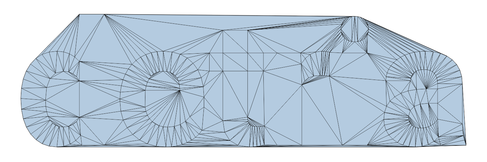
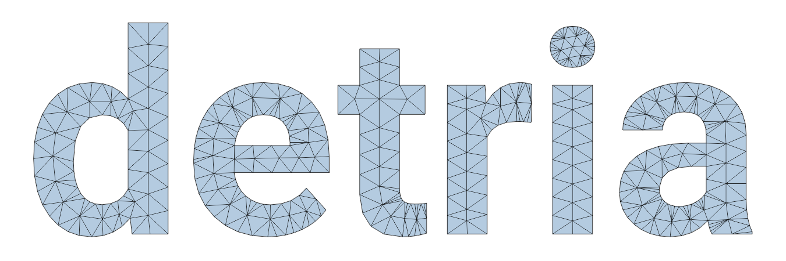
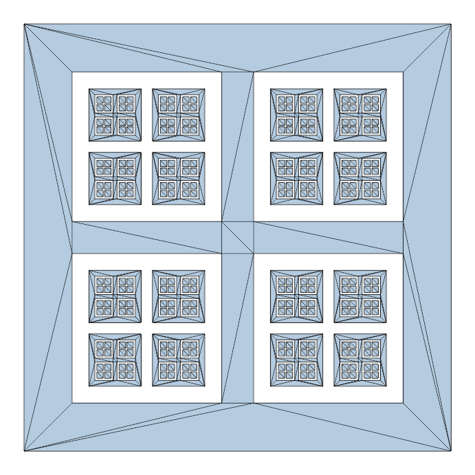

# detria - a **De**launay **tria**ngulation library

## Features
- Delaunay triangulation of a point set
- Constrained delaunay triangulation
- Support for multiple outlines and holes
- Support for Steiner points
- Geometric robustness - results will always be exact, no errors because of floating-point inaccuracy
- Properly handle edge cases (e.g. collinear or cocircular points) 
- Allows custom user types to be used (e.g. custom point type, custom allocator, etc.)
- Single file library

## Examples
Delaunay triangulation of a point set:  

Constrained delaunay triangulation:  

Interior triangles only:  

With Steiner points added:  

Note that the Steiner points are not auto-generated, they must be added manually.

Holes inside holes:  


## Requirements
Requires C++17 or later.  
No external dependencies are used, only the C++ standard library.

## Usage
Just include [`detria.hpp`](include/detria.hpp) in your project.

C++20 modules are also supported: add [`detria.cppm`](include/detria.cppm) and [`detria.hpp`](include/detria.hpp) to your project, then `import detria;`

Basic code example:

```cpp
// Create a square, and triangulate it

// List of points (positions)
std::vector<detria::PointD> points =
{
    { 0.0, 0.0 },
    { 1.0, 0.0 },
    { 1.0, 1.0 },
    { 0.0, 1.0 }
};

// List of point indices
std::vector<uint32_t> outline = { 0, 1, 2, 3 };

bool delaunay = true;

detria::Triangulation tri;
tri.setPoints(points);
tri.addOutline(outline);

bool success = tri.triangulate(delaunay);

if (success)
{
    bool cwTriangles = true;

    tri.forEachTriangle([&](detria::Triangle<uint32_t> triangle)
    {
        // `triangle` contains the point indices

        detria::PointD firstPointOfTriangle = points[triangle.x];
        detria::PointD secondPointOfTriangle = points[triangle.y];
        detria::PointD thirdPointOfTriangle = points[triangle.z];
    }, cwTriangles);
}
```

## [Documentation](DOCS.md)

## Geometric robustness
This library uses the [Fast Robust Predicates for Computational Geometry](https://www.cs.cmu.edu/~quake/robust.html) library.  
Placed in the public domain by Jonathan Richard Shewchuk.

All floating point calculations are handled by either:
- Direct floating point comparisons (e.g. `a < b`, `a == b`), which are always exact
- Calls to `orient2d` from the Robust Predicates library, which exactly decides the orientation of three points (clockwise, counter-clockwise, or collinear)
- In delaunay triangulations, the `incircle` function is used to decide if a circle (described by three points) contains a fourth point, or doesn't (or if all four points are cocircular)

## Future improvements
These might be added in the future:
- User-defined edge flip conditions (e.g. flip based on edge lengths, triangle aspect ratios, etc.)
- Performance improvements

## Non-goals
There are currently no plans to implement the following:
- Adding new points to the triangulation (e.g. conforming delaunay triangulation, triangulation refinement, resolve edge intersections)

## Benchmarks
See performance comparisons with other triangulation libraries [here](BENCHMARKS.md).

## License
Licensed under either the [WTFPL](LICENSE.txt) or the [MIT License](LICENSE-MIT.txt), at your choice.
